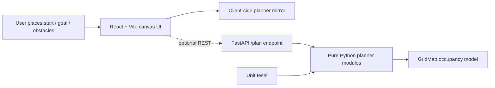

# 2D Robot Path Planning Simulator

Browser-based 2D robot simulator for placing obstacles, start, and goal cells, then comparing A*, Dijkstra, and an RRT-style planner. The project is intentionally portfolio-friendly: the UI is interactive, while the Python planning modules stay pure and testable.

## Features

- Canvas grid with obstacle, erase, start, and goal placement modes.
- A*, Dijkstra, and RRT-style path planning with visited-cell visualization.
- Stats panel for path cost, visited cells, obstacle count, runtime, and success state.
- FastAPI-style backend with a small `/plan` endpoint over testable planner modules.
- Deterministic unit tests for shortest-path behavior, unreachable maps, validation, and RRT-style expansion.

## Architecture



The frontend runs local TypeScript planner mirrors so the demo works instantly in the browser. The backend keeps the robotics logic in pure Python modules and exposes the same planning concepts through FastAPI for full-stack demonstrations.

## Project Structure

```text
robot-path-planning-simulator/
  backend/
    app/
      main.py
      planners/
        astar.py
        dijkstra.py
        grid.py
        rrt.py
    tests/
      test_planners.py
    requirements.txt
    Dockerfile
  frontend/
    src/
      App.tsx
      planners.ts
      styles.css
      types.ts
    package.json
    vite.config.ts
    Dockerfile
  docker-compose.yml
  README.md
```

## Backend Setup

Prerequisites:
- Python 3.11+
- Node.js 20.19+ or 22.12+ for the Vite 7 frontend toolchain

```bash
cd backend
python3 -m venv .venv
source .venv/bin/activate
pip install -r requirements.txt
uvicorn app.main:app --reload
```

Useful endpoints:

- `GET /health`
- `GET /algorithms`
- `POST /plan`

Example request:

```json
{
  "width": 6,
  "height": 5,
  "start": { "x": 0, "y": 0 },
  "goal": { "x": 5, "y": 4 },
  "obstacles": [{ "x": 2, "y": 0 }, { "x": 2, "y": 1 }],
  "algorithm": "astar"
}
```

## Frontend Setup

```bash
cd frontend
npm install
npm run dev
```

Open `http://localhost:5173`.

## Tests

The planner tests use Python's standard `unittest` runner and do not require FastAPI.

```bash
cd backend
python3 -m unittest discover -s tests
```

## Docker Compose

```bash
docker compose up --build
```

The frontend is served on `http://localhost:5173`; the backend listens on `http://localhost:8000`.

## Algorithm Notes

- A* uses Manhattan distance on a 4-connected grid. It remains optimal here because the heuristic never overestimates unit-cost movement.
- Dijkstra uses the same grid model without a heuristic, so it is a useful baseline for showing how many more states can be expanded.
- The RRT-style planner samples cells, finds the nearest tree node, and extends one grid step at a time. It is intentionally not optimal and may fail within the iteration budget.

This grid model is a teaching layer. A production robotics planner would need robot footprint inflation, continuous collision checking, kinematic constraints, dynamic obstacle handling, localization uncertainty, map updates, recovery behaviors, and richer cost functions.
